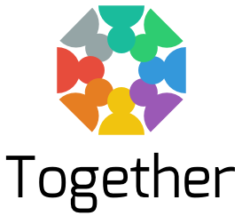

Together is a Multi-tennant collaboration Platform. It will handle your users, signup, groups, memberships and invitations. It is meant as a platform for apps that allow users of a company or organization to easily find each other on a private platform, form groups and collaborate.

You can choose to scope any or all data to a domain (as in DNS domain) based on current user's email. New users that sign up will only see the data that corresponds to their email domain.

It is a Rails Engine. It is just started, but we have big plans for it. If you're interested, leave your email adres here: http://together.launchrock.com/ and we'll keep you updated.

## Devise

Together's signup and authentication is built on devise. It currently comes with a default configuration and migration for devise tailored to the platform. It requires mostly the same stuff.

To use:

- make sure you have a route to root
- make sure you display alerts & notices in your application layout
- set the default host for action mailer:

    config.action_mailer.default_url_options = { :host => 'localhost:3000' }

## Multi-tenant

When a user signs up through devise, together will create a new tenant for his or her e-mail domain. Groups and memberships are private to that tenant. A tenant is a record and a postgresql schema. Private models work exactly like normal models, except that you only create tables for them in certain schemas.